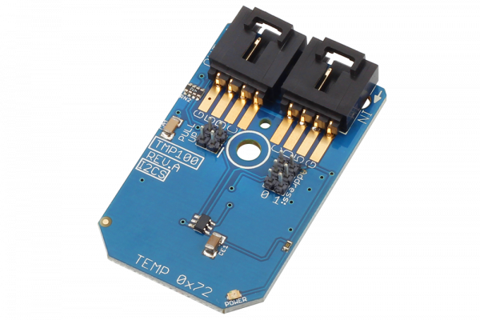

[](https://store.ncd.io/product/tmp100-temperature-sensor-%C2%B12c-12-bit-with-2-address-lines-i2c-mini-module/).

#  TMP100

The TMP100 device is a digital temperature sensor ideal for NTC and PTC thermistor replacement. The on-chip 12-bit ADC offers resolutions down to 0.0625°C. The TMP100 allows up to eight devices on one I2C bus.
This Device is available from www.ncd.io 

[SKU: TMP100]

(https://store.ncd.io/product/tmp100-temperature-sensor-%C2%B12c-12-bit-with-2-address-lines-i2c-mini-module/)
This Sample code can be used with Raspberry Pi.

Hardware needed to interface TMP100 temperature sensor With Raspberry Pi :
1. <a href="https://store.ncd.io/product/tmp100-temperature-sensor-%C2%B12c-12-bit-with-2-address-lines-i2c-mini-module/">TMP100 temperature sensor</a>
2.  <a href="https://store.ncd.io/product/i2c-shield-for-raspberry-pi-3-pi2-with-outward-facing-i2c-port-terminates-over-hdmi-port/">Raspberry Pi I2C Shield</a>
3. <a href="https://store.ncd.io/product/i%C2%B2c-cable/">I2C Cable</a>

## Python
Download and install smbus library on Raspberry pi. Steps to install smbus are provided at:

https://pypi.python.org/pypi/smbus-cffi/0.5.1

Download (or git pull) the code in pi. Run the program.

```cpp
$> python TMP100.py
```
The lib is a sample library, you will need to calibrate the sensor according to your application requirement.
